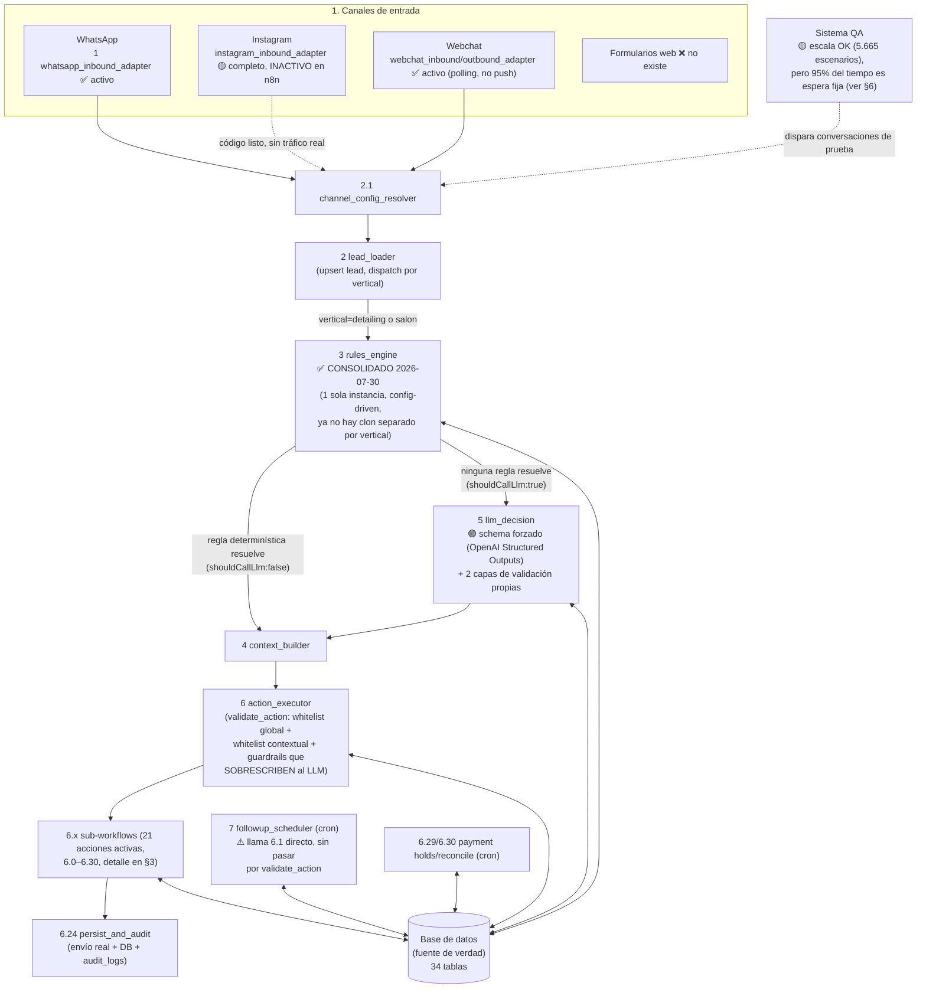

# Arquitectura del sistema — auditoría real vs. visión objetivo

**Fecha de esta auditoría**: 2026-07-30. **Método**: lectura directa del código de los 71 workflows n8n en producción (snapshot `workflows/backups/pre_rules_engine_consolidation_2026-07-29T18-00-50/`, fetched hoy vía API) + consultas SQL en vivo contra la base de datos real (Supabase). Todo lo marcado como "existe" fue confirmado leyendo código/datos reales, no inferido del nombre de un archivo. Todo lo marcado como gap fue confirmado por ausencia (grep sin resultados, tabla vacía, etc.), no asumido.

**Posicionamiento del producto**: compite en dos frentes a la vez — gestión operativa tipo AgendaPro (agenda, disponibilidad, multi-recurso, recordatorios, pagos) y venta conversacional tipo Vambe (calificar, cotizar, objetar, cerrar, seguimiento). La diferenciación central es que **la IA nunca decide precio ni ejecuta acciones críticas por sí sola** — hay una capa de reglas determinísticas y un schema de salida forzado antes de que cualquier acción se ejecute. Esta auditoría confirma que esa promesa central **sí se cumple estructuralmente** (ver §5); los gaps reales están en otro lado: cobertura de acciones de venta, formalización de la máquina de estados, y escala del sistema de QA.

---

## 1. Diagrama de componentes (flujo real, no el lineal simplificado)

---

## 2. Estado por módulo

| Módulo | Estado | Nota |
|---|---|---|
| **Canales de entrada** | 🟡 parcial | WhatsApp y Webchat activos y normalizados con el mismo contrato. Instagram: código completo pero **desactivado** en n8n (`active:false`) — no recibe tráfico real hoy. Formularios: no existe. |
| **Base de datos como fuente de verdad** | ✅ implementado | 34 tablas reales, esquema maduro (multi-tenant, leads, cotizaciones, precios versionados, citas, pagos, auditoría). Ver §4 para huecos puntuales. |
| **Máquina de estados comercial** | ✅ formalizada 2026-07-31 (schema sin cambios, a propósito) | El estado se persiste (`lead_state.stage`) y se usa de verdad. Sigue siendo `text` libre —el `CHECK` se evaluó y se descartó por riesgo, ver §7.1—, pero los 16 estados canónicos y el grafo real de transiciones están documentados en [`docs/arquitectura/ESTADOS_LEAD_STATE.md`](docs/arquitectura/ESTADOS_LEAD_STATE.md) y protegidos por un guard en el harness. |
| **Rules engine (determinístico)** | ✅ implementado, y **mejorado hoy mismo** | Antes de esta sesión existían dos motores clonados (detailing/salón) mantenidos en paralelo manualmente. Hoy quedó consolidado en un solo motor config-driven; salón migrado y verificado a paridad; clon viejo archivado. Reglas de pago sí existen (`ruleAskPaymentPreference`, `payment_mode`). Reglas de multi-recurso/staff sí se invocan (el diagnóstico inicial de "código muerto" era incorrecto); se corrigieron 2 bugs reales el 2026-07-31 y quedaron pineadas en el harness, pero siguen inactivas por configuración — ver la nota de corrección en §3. |
| **LLM Decision Layer** | ✅ implementado, con garantía técnica real | Contrato de salida forzado por JSON Schema (`response_format` con `enum` dinámico de `allowed_actions`, `strict:true`) vía OpenAI Structured Outputs — no es solo una instrucción de prompt. Doble validación posterior en código (schema + reglas de negocio) antes de ejecutar. El LLM **no tiene ningún campo de precio** en su schema de salida — estructuralmente no puede inventar precio. |
| **Action Executor** | ✅ implementado | 21 acciones activas con whitelist global + contextual, y guardrails de código que sobrescriben al LLM en casos críticos (queja, urgencia, handoff activo). Un camino (`7 followup_scheduler`) llama directo a `6.1` sin pasar por esta validación — no es una IA generando contenido ahí hoy, pero es un precedente a vigilar. |
| **Sistema de pagos (Flow.cl)** | ✅ implementado | Cotizar → preferencia de pago → link (prepago) o postpago → confirmación por webhook → holds expirados liberados por cron → reconciliación por cron. Multi-tenant (credenciales por organización). No está expuesto como "acciones" nombradas del catálogo objetivo (`send_payment_link`, etc.) sino como lógica interna de `confirm_booking`. |
| **Multi-recurso/multi-profesional** | ❌ no implementado funcionalmente | Existe la tabla `agent_staff` (con columna `schedule` jsonb) y una regla de selección de personal ya escrita — pero esa regla **nunca se invoca** desde el árbol de reglas activo. Hoy el sistema no asigna recurso/profesional en la práctica. |
| **Sistema QA** | 🟡 parcial — pero por otro motivo del que se creía | ⚠️ Corregido 2026-08-01: **sí escala** — 5.665 escenarios únicos, 14.194 resultados, pico de 1.070 escenarios/día y 212/hora. El cuello no es el volumen sino que el 95% de cada corrida es espera fija (390 s hardcodeados por escenario contra 4,2 s de latencia real del bot); ver [`docs/arquitectura/QA_ESCALA.md`](docs/arquitectura/QA_ESCALA.md). Lo que sí sigue siendo un gap real: solo 2 de los 7 criterios se validan determinísticamente; los otros 5 los juzga el mismo modelo de producción evaluándose a sí mismo. |

---

## 3. Catálogo de acciones — existentes vs. objetivo

### Acciones que sí existen, con nombre idéntico o equivalente

| Acción objetivo | Estado | Nombre/mecanismo real |
|---|---|---|
| `ask_missing_data` | ✅ | idéntico — `6.7` |
| `send_quote` | ✅ | idéntico — `6.8` |
| `recommend_service` | ✅ | idéntico — `6.18` |
| `offer_booking` | ✅ | idéntico — `6.20` |
| `confirm_booking` | ✅ | idéntico — `6.5`, única acción con branching interno (pago/calendario) |
| `cancel_booking` | ✅ | idéntico — `6.6` |
| `request_review` | ✅ | idéntico — `6.15` |
| `collect_vehicle_type` / `collect_district` / `collect_service_interest` | 🟡 | no son acciones propias, son `next_goal` internos consumidos por `ask_missing_data` |
| `answer_general_question` | 🟡 | nombre real: `answer_question` (`6.9`), sin distinción "general" |
| `answer_price_objection` / `answer_delay_objection` | 🟡 | cubiertas por una única acción genérica `answer_objection` (`6.19`) |
| `check_availability` / `suggest_slots` | 🟡 | cubiertas por `offer_available_slots` (`6.23`, llama a `6.2`/`6.4`) |
| `modify_booking` | 🟡 | nombre real: `reschedule_booking` (`6.10`) |
| `prevent_double_booking` | 🟡 | no es acción, es guardia técnica (lock + chequeo de slot) |
| `appointment_reminder` | 🟡 | no es acción LLM-dispatchable, es followup automático (`7 followup_scheduler`) |
| `no_response_followup` / `quote_followup` | 🟡 | cubiertas por `schedule_followup` genérico (`6.21`) y followups automáticos insertados por `6.24` |
| `post_service_message` | 🟡 | cubierta por followup automático + acciones manuales `request_review`/`request_referral`/`notify_on_the_way` |
| `human_handoff` | 🟡 | nombre real invertido: `handoff_human` (`6.22`) |
| `stop_after_handoff` | 🟡 | no es acción, es guard-lock en `validate_action` |
| `resume_after_handoff` | 🟡 | existe como workflow (`8.1`) pero **huérfano** — nadie lo llama hoy |

### Acciones que NO existen (sin rastro en el código)

`new_lead_creation`, `identify_returning_lead` (existe detección interna pero no como acción propia), `collect_name`, `quote_explanation`, `upsell_service`, `competitor_comparison`, `reactivate_old_customer` (existe detección interna pero no como acción propia), `detect_angry_customer` (existe detección interna pero fuerza `handoff_human`, no es una acción propia), `out_of_scope_question`, `spam_detection`.

### Frente de pagos/multi-recurso — específico

| Acción objetivo | Estado |
|---|---|
| `send_payment_link` | 🟡 — lógica real existe (`6.26 payment_request`) pero se dispara desde código interno de `confirm_booking`, no como acción nombrada que el LLM elija |
| `confirm_payment` | 🟡 — existe como webhook externo de Flow.cl (`6.27`), no como acción disparada por decisión |
| `request_deposit` | 🟡 — cubierta parcialmente por `ask_payment_preference` (`6.25`) |
| `payment_reminder` | 🟡 — existe dentro del cron `6.29`, no como acción propia |
| `assign_resource` | ✅ **corregido 2026-07-31** — no era código muerto: `ruleStaffSelectionReplyProvided` sí está en el array activo de reglas y sí se invoca. Ver la nota de corrección abajo. |
| `reassign_resource` | ❌ no existe (cambiar de persona en una reserva ya creada requiere cancelar y reagendar) |

> **Corrección de esta auditoría (2026-07-31).** La afirmación original de que el
> multi-recurso era "código muerto que nunca se invoca" **era incorrecta** — se
> verificó ejecutando el motor real. La cadena completa existe y funciona:
> `2 lead_loader` carga `agent_staff` → el motor pregunta "¿con quién prefieres
> agendar?" cuando hay >1 persona elegible y `staff_selection_mode = "ask_customer"`
> → `ruleStaffSelectionReplyProvided` procesa la respuesta y asigna
> `staff_id`/`staff_name`/`calendar_id` → `6.4 list_available_slots` filtra las citas
> de la DB por `staff_id` para no sobre-agendar a la misma persona.
>
> Lo que sí era cierto es que **nunca se había activado en ningún agente**
> (ningún `agent_business_config` tiene `staff_selection_mode = "ask_customer"`;
> el único agente con >1 fila en `agent_staff` está en modo `auto`), así que estos
> caminos jamás vieron tráfico real. Al ejercitarlos aparecieron dos defectos
> reales, ambos corregidos y desplegados el 2026-07-31:
> 1. El reconocimiento de la respuesta exigía el nombre **completo** tal cual sale
>    en el menú ("Camila (Junior)"); responder `"Camila"` —lo natural— no se
>    reconocía y el bot volvía a preguntar en loop. Ahora acepta nombre parcial,
>    nombre dentro de una frase, y `"cualquiera"`/`"da lo mismo"` (delega la
>    elección). Si dos personas comparten nombre, no adivina: vuelve a preguntar.
> 2. En la ruta OAuth de `6.2`/`6.3`/`6.4`, el calendario del agente pisaba
>    silenciosamente el `calendar_id` de la persona elegida, así que la
>    disponibilidad y la reserva iban al calendario compartido en vez del de esa
>    persona (la ruta no-OAuth sí lo respetaba: las dos rutas discrepaban). Ahora
>    el calendario de la persona tiene prioridad cuando existe.
>
> El código muerto real, ya eliminado, era la función `findStaffInReply`: estaba
> definida pero nunca se llamaba porque su lógica estaba duplicada e inlineada
> dentro de la regla. Quedó una sola implementación, usada por la regla.
>
> Estado actual: **la feature funciona y está pineada con 11 escenarios** en
> `scripts/rules_engine_regression_harness.js`, pero sigue **inactiva por
> configuración** — activarla es poner `staff_selection_mode = "ask_customer"` y
> cargar filas en `agent_staff` (ver `docs/PER_NUMBER_CONFIG_GUIDE_2026-06-20.md`
> §3.5). Con `agent_staff.calendar_id` vacío el negocio opera con calendario
> compartido: el bot igual pregunta y registra quién atiende.

### Acciones activas no contempladas en el catálogo objetivo (hallazgo adicional)

El sistema real tiene acciones que la visión objetivo no menciona: `collect_address`/`confirm_address` (`6.11`/`6.12`), `send_pre_service_instructions` (`6.13`), `notify_on_the_way` (`6.14`), `request_referral` (`6.16`), `send_service_menu` (`6.17`), `schedule_followup` (`6.21`), `offer_available_slots` (`6.23`), `ask_payment_preference` (`6.25`), `check_payment_status` (`6.28`). Vale la pena decidir si el catálogo objetivo se actualiza para incluirlas explícitamente, ya que hoy hacen trabajo real.

---

## 4. Máquina de estados — lo que hay vs. lo que se pidió

> **Esta sección quedó superada por [`docs/arquitectura/ESTADOS_LEAD_STATE.md`](docs/arquitectura/ESTADOS_LEAD_STATE.md)
> (2026-07-31)**, que formaliza la máquina de estados con el grafo real de
> transiciones. Ese documento es ahora la fuente de verdad; lo de abajo se
> conserva con las correcciones marcadas, porque dos afirmaciones eran erróneas.

**No hay ningún CHECK/enum en la base de datos sobre `lead_state.stage`** — es `text` libre (esto sigue siendo cierto). El vocabulario real es de **16 valores canónicos**, no 14:

- **Coinciden con la visión**: `new_lead`, `quoted`, `closing`, `post_service`, `human_handoff`.
- **La visión los nombra distinto**: `qualifying` → el código usa `qualified`. ⚠️ **Corrección**: la nota original decía "casi sin uso real" basándose en las 11 filas del snapshot; en realidad tiene **2.162 turnos históricos** — es un estado de paso rápido hacia `quoted`, no uno abandonado. `objection` → efectivamente no es un `stage`, es un tipo de acción.
- **No existen**: `payment_pending`, `reactivation`.
- ⚠️ **Corrección — `lost` sí existió**: la afirmación de que "no existe en ningún lugar" era incorrecta. Hay 4 turnos en `audit_logs` de un lead real (2026-06-18). Ningún código actual lo escribe, así que hoy está muerto, pero existió.
- **Existen en código/datos pero no estaban en la visión**: `service_discovery`, `booking_selection`, `collecting_address`, `address_confirmation`, `booking_confirmation`, `cancelling`, `reschedule`, `booked_pending`, `cancelled` — el flujo real de booking es mucho más granular que la visión teórica. (`continue_conversation` figuraba en esta lista pero **no es un estado**: es un nombre de acción que se filtró al campo una sola vez, en un lead, el 2026-07-06.)

**Sobre `payment_pending`**: el sub-sistema de pago vive en columnas propias (`payment_status`/`payment_preference`/`flow_order_id`/`payment_mode`). ⚠️ **Matiz sobre la afirmación original** de que `booked_pending` es "de facto payment_pending, coexiste con `payment_status` no nulo en la gran mayoría de los casos": son 46 de 59 (78%), y los otros 13 **no tienen `payment_status` en absoluto**. O sea que `booked_pending` significa dos cosas distintas, no es equivalente a `payment_pending`. La recomendación del documento nuevo es **no** introducir `payment_pending` como stage: el estado del pago ya tiene su columna, duplicarlo en `stage` partiría la verdad en dos lugares.

**Metodología — por qué la auditoría original se equivocó**: se apoyó en `lead_state` (snapshot del estado actual). Ese snapshot subcuenta sistemáticamente los estados transitorios: `address_confirmation` tiene **0 leads** ahí y sin embargo es uno de los más transitados del sistema (509 turnos). La fuente correcta para el vocabulario es `audit_logs.stage_before` (15.431 turnos), no la foto instantánea.

---

## 5. La promesa central ("la IA nunca decide cosas críticas") — verificada

Esto es lo más importante de confirmar y **se cumple realmente, no solo de palabra**:

1. La salida del LLM está forzada por un **JSON Schema con `enum` dinámico** (`response_format: {type:'json_schema', strict:true}`, OpenAI Structured Outputs) — `action` solo puede ser uno de los `allowed_actions` de ese turno específico. No es solo una instrucción de prompt que el modelo podría ignorar.
2. Después de la respuesta, hay **dos validaciones más en código propio** (`validate_schema_and_required_fields`, `validate_business_rules`) antes de aceptar la decisión — si fallan, se cae a una decisión determinística de respaldo (`build_fallback_decision`), sin LLM.
3. En `6 action_executor`, una **cuarta capa** (`validate_action`) chequea contra una whitelist global de 21 acciones y contra la whitelist contextual del turno, y además **sobrescribe activamente** la decisión del LLM en casos críticos detectados por código (queja, urgencia, handoff ya activo).
4. El **precio nunca puede salir del LLM**: no hay ningún campo de precio en su schema de salida; el precio siempre se resuelve por separado en `6.0 resolve_pricing_from_db` con una consulta SQL parametrizada solo por identificadores categóricos.

**Matiz honesto**: `7 followup_scheduler` (cron de recordatorios automáticos) llama directo a `6.1 send_outbound_message` sin pasar por `validate_action`. Hoy no genera contenido con IA (usa plantillas fijas), así que no es un incumplimiento de la promesa — pero es el único punto del sistema que no pasa por la capa de validación, y sería el primer lugar a blindar si algún día se le agrega redacción por IA a los recordatorios.

---

## 6. Sistema QA — capacidad real de escala

- **Sí está en uso real**: 14,194 resultados históricos, ~49 escenarios activos hoy entre las dos tablas de escenarios.
- **No está diseñado para "cientos o miles" simultáneos**: límites concretos encontrados en el código — `$MaxScenarios` default 10, `$BatchSize` default 20, el batch más grande registrado en 106 corridas históricas fue 25, y el runner nativo de n8n (`9.1`/`9.1.1`) procesa **un escenario a la vez** (batch size 1), con esperas de hasta 150s por paso — una corrida de cientos tomaría horas. El propio equipo documentó en el código que ese runner nativo tiene un bug conocido de corte prematuro en escenarios largos, y por eso construyó scripts paralelos (`qa_e2e_conversation_test.ps1`) que disparan webhooks directo.
- **De los 7 criterios de validación pedidos, solo 2 están automatizados de forma determinística** (acción correcta, actualización de estado correcta), y son opt-in (dependen de que el autor del escenario haya escrito las expectativas). Los otros 5 (intención, reglas de negocio, no-alucinación, contexto, avance a conversión) dependen de un juez LLM — que es **el mismo modelo de producción evaluándose a sí mismo**, no una segunda opinión independiente — y en última instancia de lectura humana de las notas del juez.

---

## 7. Gaps críticos priorizados

1. ~~**Formalizar la máquina de estados**~~ — **hecho 2026-07-31**: [`docs/arquitectura/ESTADOS_LEAD_STATE.md`](docs/arquitectura/ESTADOS_LEAD_STATE.md) documenta los 16 estados canónicos, el grafo real de transiciones (derivado de 15.431 turnos de `audit_logs`, no de la teoría) y las 2 anomalías encontradas. El vocabulario quedó protegido por un guard en `scripts/rules_engine_regression_harness.js` que falla si el motor introduce un estado fuera de la lista. **Se evaluó y descartó el `CHECK` en la base**: abortaría la escritura en `6.24 persist_and_audit` (único camino de persistencia), o sea que el bot dejaría de responder en vez de degradar — a cambio de atrapar 2 valores espurios en 15.431 turnos. Queda abierto: limpiar el lead con `continue_conversation` y decidir qué hacer con `cancelled` (sin uso desde 2026-06-18) y con las 26 reservas retenidas con pago `expired`.
2. ~~**Multi-recurso/multi-profesional real**~~ — **resuelto 2026-07-31**. El diagnóstico original ("código que nunca se conecta") era incorrecto: sí estaba conectado, solo que nunca activado por configuración. Al ejercitarlo aparecieron 2 bugs reales, ya corregidos y desplegados, y el comportamiento quedó pineado con 11 escenarios en el harness. Ver la nota de corrección en §3. Lo único pendiente aquí es **decidir en qué agente activarlo** (`staff_selection_mode = "ask_customer"`), que es una decisión de negocio, no de ingeniería. `reassign_resource` (cambiar de persona sin cancelar) sigue sin existir.
3. **Ampliar el catálogo de acciones de venta** (`quote_explanation`, `upsell_service`, `competitor_comparison`, `answer_price_objection`/`answer_delay_objection` como acciones distintas en vez de una genérica) — esto es lo que separa "agendador" de "vendedor digital", y hoy es la brecha más grande respecto a la visión de producto.
4. **Cerrar o resolver deliberadamente los cabos sueltos de infraestructura encontrados en esta auditoría** (no bloqueantes pero acumulan riesgo silencioso): `8.1 reactivate_bot_after_handoff` huérfano, el camino roto de `whatsapp_webhook_meta` apuntando a un workflow inexistente, la duplicación de credenciales de Google Calendar y Flow.cl en dos lugares cada una, y el `followup_type` sin plantilla (`post_quote_postponed_24h`) que cae silenciosamente a un mensaje genérico.
5. **Escalar el sistema de QA** — ⚠️ **diagnóstico corregido 2026-08-01**, ver [`docs/arquitectura/QA_ESCALA.md`](docs/arquitectura/QA_ESCALA.md). La premisa "está acotado a decenas" **era incorrecta**: el sistema ya lleva 5.665 escenarios únicos y 14.194 resultados, con un pico real de 1.070 escenarios en un día y 212 en una hora (o sea ~25 en paralelo). El `$MaxScenarios = 10` que se citó como tope es el default de un parámetro, no un límite. El problema real es que `9.1.1` tiene tres `Wait` de tiempo fijo (120+120+150 = **390 s por escenario**) mientras el bot responde en **4,2 s p50 / 14,6 s p99** medido sobre 4.012 turnos reales — o sea que el 95% de una corrida de QA es sleep. Reemplazar esas esperas por sondeo bajaría un escenario de ~411 s a ~30 s (**~10× throughput**: 5.000 escenarios pasarían de ~24 h a ~3 h) y además convertiría los timeouts en fallos explícitos en vez de falsos positivos silenciosos. **Pendiente de aprobación** por ser un cambio de control de flujo en un workflow de 31 nodos. Lo que sigue en pie del gap original: el juez de los 5 criterios subjetivos es el mismo modelo de producción evaluándose a sí mismo — y correr más rápido no arregla eso.
6. **`payment_pending` como estado de primera clase**: ya hay todos los datos (`payment_status`, `payment_preference`, etc.) — falta la decisión de diseño de cómo se integra con `stage` en vez de vivir como sub-sistema paralelo.

---

## Notas de alcance de esta auditoría

- No se tocó código de producción — esta es una auditoría de solo lectura.
- Fuente primaria: snapshot de los 71 workflows vivos fetched hoy directo de la API de n8n, más consultas SQL en vivo. Cuando había copias desactualizadas en `workflows/exports/`, se usó siempre la más reciente por `updatedAt` interno del JSON.
- Todo lo reportado como gap fue confirmado por ausencia real (grep sin resultados, tabla vacía, código nunca invocado) — no es una suposición de que "probablemente no existe".
