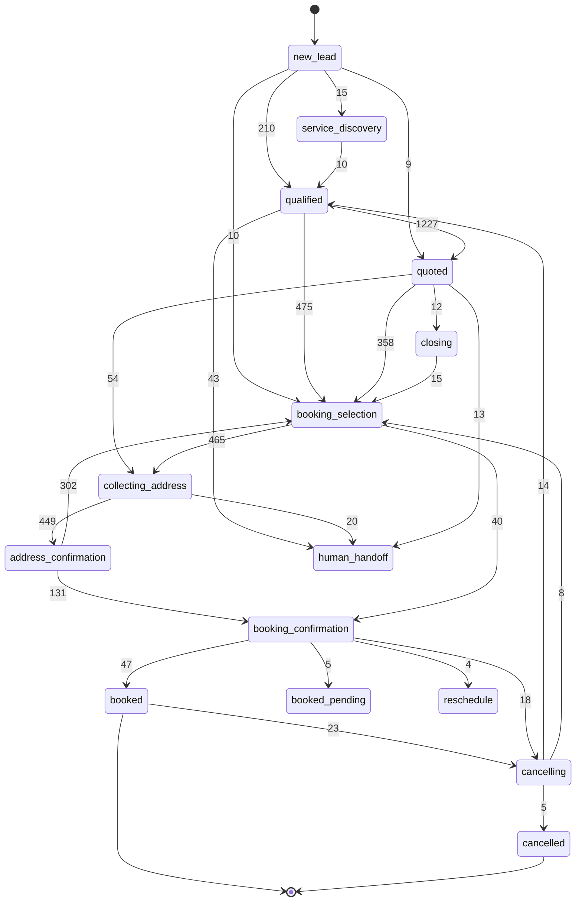

# Máquina de estados de `lead_state.stage`

Fecha: 2026-07-31 · Estado: **diagnóstico completo, cambios de schema pendientes de aprobación**

Este documento formaliza los estados por los que pasa un lead. Es el paso 1 del gap
#1 de [`ARCHITECTURE.md`](../../ARCHITECTURE.md) ("la máquina de estados no está
formalizada"): antes de imponer un enum o un `CHECK`, había que saber **cuál es el
vocabulario real**, y eso no estaba escrito en ningún lado.

Todo lo de acá está derivado de datos y código reales, no de la visión teórica:

| Fuente | Qué es | Cobertura |
|---|---|---|
| `lead_state.stage` | snapshot del estado **actual** de cada lead | 6.252 leads |
| `audit_logs.stage_before` | estado al **inicio** de cada turno (histórico) | 15.431 turnos desde 2026-04-15 |
| Código | `stage: "..."` en los Code nodes de los workflows | 71 workflows |

> **Por qué hacen falta las tres.** El snapshot solo, engaña: `address_confirmation`
> tiene **0 leads** en `lead_state` y sin embargo es uno de los estados más
> transitados del sistema (509 turnos). Es un estado *transitorio* — los leads pasan
> por él pero rara vez descansan ahí, así que una foto instantánea no lo ve. El
> `audit_logs` es la fuente autoritativa del vocabulario; el snapshot solo dice
> dónde se acumulan los leads hoy.

## 1. Vocabulario canónico (16 estados)

Son exactamente los 16 que el código escribe hoy. Ordenados por el flujo comercial:

| # | Estado | Turnos (hist.) | Leads (hoy) | Rol |
|---|---|---:|---:|---|
| 1 | `new_lead` | 4.584 | 3.766 | entrada — lead recién creado, sin calificar |
| 2 | `service_discovery` | 129 | 43 | explorando qué servicio necesita |
| 3 | `qualified` | 2.162 | 11 | datos mínimos completos, listo para cotizar |
| 4 | `quoted` | 3.662 | 990 | cotización enviada |
| 5 | `closing` | 132 | 106 | manejo de objeción / empuje al cierre |
| 6 | `booking_selection` | 1.847 | 362 | eligiendo horario entre los ofrecidos |
| 7 | `collecting_address` | 588 | 58 | pidiendo dirección (solo negocios a domicilio) |
| 8 | `address_confirmation` | 509 | **0** | confirmando la dirección — **transitorio** |
| 9 | `booking_confirmation` | 222 | 3 | confirmando la reserva antes de crearla |
| 10 | `booked_pending` | 25 | 59 | reserva retenida, aún no firme (ver §4) |
| 11 | `booked` | 113 | 344 | reserva creada y confirmada |
| 12 | `post_service` | 31 | 16 | servicio ya realizado (reseña / recompra) |
| 13 | `cancelling` | 107 | 27 | cancelación en curso |
| 14 | `cancelled` | 17 | 4 | cancelado — **moribundo**, sin uso desde 2026-06-18 |
| 15 | `reschedule` | 16 | 9 | reagendamiento en curso |
| 16 | `human_handoff` | 643 | 453 | derivado a humano, bot en pausa |

`qualified` ilustra lo mismo que `address_confirmation` en menor escala: 2.162 turnos
históricos pero solo 11 leads hoy — es de paso rápido hacia `quoted`.

## 2. Grafo real de transiciones

Reconstruido pareando turnos consecutivos del mismo lead en `audit_logs` (últimos 60
días, solo transiciones con ≥3 ocurrencias). El grosor de la relación es el número de
veces observado.



Observaciones del grafo real que no son obvias desde el código:

- **El camino feliz dominante es `qualified → quoted → booking_selection →
  collecting_address → address_confirmation → booking_confirmation → booked`.**
- **`address_confirmation → booking_selection` (302) supera a
  `address_confirmation → booking_confirmation` (131)**: la mayoría de las veces,
  después de confirmar la dirección el lead vuelve a elegir horario en vez de avanzar
  a confirmar. Vale la pena revisar si es un rebote esperado o fricción del flujo.
- **`qualified → new_lead` (16) y `quoted → qualified` (5) son retrocesos**: el estado
  no es monótono. Cualquier `CHECK` o enum debe permitir retrocesos, no asumir avance
  lineal.
- **No hay transición hacia `post_service` con ≥3 ocurrencias** — se llega ahí por el
  cron de seguimiento, no por un turno de conversación, así que el pareo por turnos no
  lo captura.

## 3. Anomalías encontradas (2 valores fuera del vocabulario)

Ninguno lo escribe el código actual. Son datos viejos, de un lead cada uno:

| Valor | Dónde | Qué es |
|---|---|---|
| `continue_conversation` | 1 lead en `lead_state`, 2026-07-06 | Es un nombre de **acción/resolución** (`ruleDefaultContinue`), no un estado. Se filtró al campo `stage` una sola vez y nunca se repitió. |
| `lost` | 4 turnos en `audit_logs`, 1 lead, 2026-06-18 | Estado terminal que existió alguna vez pero ningún código actual escribe. `ARCHITECTURE.md` afirmaba que "no existe en ningún lugar" — era incorrecto, existió; hoy está muerto. |

Ambos deberían limpiarse antes de imponer un `CHECK`, porque lo harían fallar.

## 4. `booked_pending` está sobrecargado (hallazgo principal)

La visión de producto pedía un estado `payment_pending`. La auditoría anterior dijo
que "existe de facto como `booked_pending`". Los datos matizan eso:

| `booked_pending` | Leads |
|---|---:|
| con `payment_status` (`expired` 26, `pending` 18, `paid` 2) | 46 |
| **sin `payment_status`** | **13** |

O sea que `booked_pending` significa hoy **dos cosas distintas**: "reserva esperando
pago" (78%) y "reserva retenida sin pago de por medio" (22%). No es equivalente a
`payment_pending`.

Además, el `payment_status` más común dentro de `booked_pending` es `expired` (26 de
46): son reservas retenidas cuyo pago caducó y que igual siguen ocupando el estado.
Eso es un problema operativo, no solo de nomenclatura.

**Recomendación**: no renombrar ni introducir `payment_pending` como estado nuevo.
El estado del pago ya vive en su propia columna (`payment_status`), que es la
modelación correcta — meterlo también en `stage` duplicaría la verdad en dos lugares.
Lo que sí conviene es decidir qué hacer con los `expired` retenidos.

## 5. Propuesta de formalización — **pendiente de aprobación, nada ejecutado**

En orden de menor a mayor riesgo:

**Paso 1 — limpiar las 2 anomalías** (bajo riesgo, 1 lead cada una):
```sql
-- continue_conversation: era una accion, no un estado. El lead quedo en
-- answer_question/identify_service_need, o sea todavia calificando.
UPDATE lead_state SET stage = 'new_lead'
WHERE stage = 'continue_conversation';
```
(`lost` solo vive en `audit_logs`, que es histórico inmutable — no se toca.)

**Paso 2 — documentar el vocabulario en la propia tabla** (sin riesgo, no valida nada):
```sql
COMMENT ON COLUMN lead_state.stage IS
  'Estado del lead. Vocabulario canonico (16) documentado en '
  'docs/arquitectura/ESTADOS_LEAD_STATE.md. No es monotono: hay retrocesos '
  'legitimos (cancelling->qualified, qualified->new_lead).';
```

**Paso 3 — `CHECK` constraint** (el que realmente previene regresiones):
```sql
ALTER TABLE lead_state ADD CONSTRAINT lead_state_stage_valido
CHECK (stage IN (
  'new_lead','service_discovery','qualified','quoted','closing',
  'booking_selection','collecting_address','address_confirmation',
  'booking_confirmation','booked_pending','booked','post_service',
  'cancelling','cancelled','reschedule','human_handoff'
)) NOT VALID;
```
`NOT VALID` a propósito: aplica a filas nuevas sin re-escanear las 6.252 existentes ni
bloquear la tabla. Una vez hecho el Paso 1 se puede promover con
`ALTER TABLE lead_state VALIDATE CONSTRAINT lead_state_stage_valido;`.

> **Riesgo a considerar antes de aprobar el Paso 3.** Un `CHECK` convierte un estado
> inesperado en un **error duro que aborta la escritura**, y `6.24 persist_and_audit`
> es el único camino de persistencia del pipeline. Si mañana alguien agrega un estado
> nuevo en el motor de reglas y olvida el `CHECK`, el bot deja de responderle a ese
> lead en vez de degradar. Dado que en 15.431 turnos hubo exactamente 2 valores
> espurios, **el `CHECK` compra poco y puede costar caro**. La alternativa más barata
> y sin ese riesgo es un escenario en el harness que falle si el código introduce un
> estado fuera de la lista — mismo efecto preventivo, en tiempo de desarrollo en vez
> de en runtime de producción.

## 6. Qué queda abierto

- Decidir Paso 3 (`CHECK`) vs. la alternativa de validarlo en el harness.
- `cancelled` no se usa desde 2026-06-18 (`cancelling` sí, 107 turnos): confirmar si
  el flujo de cancelación quedó sin estado terminal, o si `cancelled` es prescindible.
- El rebote `address_confirmation → booking_selection` (302 veces, más que el avance):
  entender si es fricción real del flujo.
- Las 26 reservas en `booked_pending` con pago `expired`: definir si se liberan.
