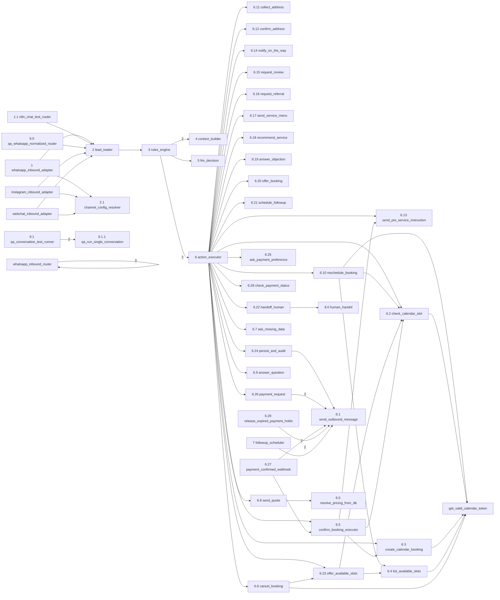

# Grafo de dependencias entre workflows

> **Generado** por `node scripts/extract_workflow_code.js`. No editar a mano.

Cada flecha es un nodo `executeWorkflow` (un workflow llamando a otro). Se excluyen los workflows aislados, que se listan aparte mas abajo.

## Resumen

- Workflows totales: **73**
- Llamadas `executeWorkflow`: **68** (60 pares distintos)
- Con destino dinamico (expresion, no resoluble estaticamente): **0**
- Workflows aislados (ni llaman ni son llamados): **23**

### Destinos que no resuelven a ningun export

El `workflowId` apunta a un id que no existe entre los exports locales. O el workflow vive solo en n8n y nunca se exporto, o quedo una referencia colgada a uno borrado.

- `whatsapp_webhook_meta` :: `WF whatsapp_inbound_router` → `whatsapp_inbound_router` (id `whatsapp_inbound_router`)
- `whatsapp_webhook_meta` :: `WF whatsapp_inbound_router` → `whatsapp_inbound_router` (id `whatsapp_inbound_router`)
- `whatsapp_webhook_meta` :: `WF whatsapp_inbound_router` → `whatsapp_inbound_router` (id `whatsapp_inbound_router`)

### Workflows aislados

No aparecen en el grafo porque ningun `executeWorkflow` los referencia y ellos no llaman a nadie. Puede ser legitimo (se disparan por webhook, cron o trigger de n8n) o puede ser que hayan quedado huerfanos — vale la pena revisarlos.

- 6.30 reconcile_pending_payments
- 8.1 reactivate_bot_after_handoff
- ChatBot AhumadaDetialing
- My Sub-Workflow 1
- My Sub-workflow
- My workflow
- Payment Error Alerts
- QA Notify via Telegram
- QA Summary Every 5 Min
- Verificacion del webhook (Meta)
- WA Reminders
- check_calendar_token
- disconnect_google_calendar
- get_fresh_google_calendar_token
- google_calendar_oauth_callback
- health_check_agents
- onboarding_add_channel
- onboarding_create_agent
- onboarding_manage_service
- webchat_outbound_adapter
- whatsapp_register_number
- whatsapp_register_number
- whatsapp_register_number
